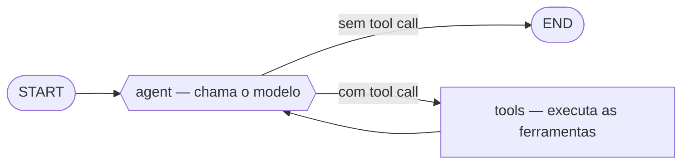
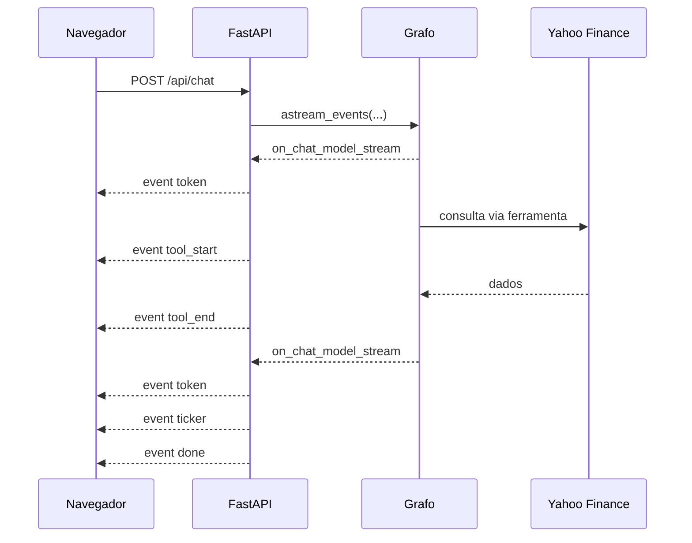

# Graham Agent

> Seu corretor de confiança.

Um agente conversacional que responde perguntas sobre ações, empresas e setores consultando a Yahoo Finance em tempo real. O nome é uma homenagem a Benjamin Graham, e a interface segue essa ideia: papel off-white, tipografia serifada e respostas que se leem com calma, sem o ruído de um terminal de operações.

O projeto é de estudo. As cotações vêm com atraso e nada aqui é recomendação de investimento.

---

## O que ele faz

Você pergunta em linguagem natural — *"Quanto vale BBAS3 hoje?"*, *"Notícias da Petrobras"*, *"Compare ouro e Bitcoin"* — e o agente decide sozinho quais consultas precisa fazer, executa e explica o resultado.

A resposta chega **token a token**, com os dados aparecendo conforme são buscados. Ao final, os tickers citados viram cartões de cotação recolhíveis, e cada consulta feita pode ser aberta para inspeção (argumentos enviados e JSON devolvido).

### Ferramentas disponíveis ao agente

| Ferramenta | Argumentos | O que retorna |
|---|---|---|
| `cotacao_atual_acao` | `ticker_name` | Preço, variação do dia, abertura, máxima/mínima, volume, valor de mercado, faixa de 52 semanas e médias móveis |
| `noticias_acao` | `ticker_name`, `count`, `tab` | Notícias recentes com título, resumo, data, veículo e link |
| `buscar_ticker_por_empresa` | `company_name`, `count` | Tickers correspondentes a um nome de empresa, com bolsa, setor e indústria |
| `buscar_tickers_por_industria` | `industry`, `count`, `region` | Principais empresas de um dos 145 subsetores da classificação Yahoo |

As ferramentas são registradas automaticamente: `TOOLS`, em `src/agent/tools/definition.py`, varre o próprio módulo com `inspect` e recolhe todo objeto `BaseTool`. Para adicionar uma ferramenta, basta declará-la com `@tool` no arquivo — não há lista para atualizar em outro lugar.

---

## Requisitos

- **Python 3.13+**
- **[uv](https://docs.astral.sh/uv/)** para gerenciar o ambiente e as dependências
- Uma **chave de API** de um provedor compatível com a API da OpenAI

Não é preciso Node nem qualquer passo de build: o front-end é HTML, CSS e JavaScript puros, servidos direto pelo FastAPI.

### Dependências

Declaradas em `pyproject.toml` e resolvidas pelo `uv`:

| Pacote | Papel |
|---|---|
| `langgraph` | Orquestra o ciclo ReAct do agente |
| `langchain[openai]` | Cliente do modelo e definição das ferramentas |
| `yfinance` | Fonte dos dados de mercado |
| `pandas` | Tratamento das séries que o `yfinance` devolve |
| `fastapi` + `uvicorn` | Servidor HTTP e streaming SSE |
| `dotenv` | Carrega as credenciais do `.env` |

---

## Instalação

```bash
git clone <url-do-repositorio>
cd graham
uv sync
```

### Variáveis de ambiente

Crie um arquivo `.env` na raiz do projeto:

```dotenv
MODEL_PROVIDER_BASE_URL=https://ai-gateway.vercel.sh/v1
MODEL_PROVIDER_API_KEY=sua-chave-aqui
```

`MODEL_PROVIDER_BASE_URL` precisa apontar para um endpoint compatível com a API de *chat completions* da OpenAI. Sem ela, o `ChatOpenAI` cai no padrão (`api.openai.com`) e a chave do seu provedor é rejeitada com `401`.

### Configuração do modelo

O modelo e seus parâmetros ficam em `src/agent/config/settings.toml`, separados das credenciais:

```toml
[llm]
model = "deepseek/deepseek-v4-flash"
temperature = 0.2
timeout = 60
```

O modelo escolhido precisa suportar **tool calling** e **streaming** — sem os dois, o agente não consegue consultar dados nem responder progressivamente.

As instruções do agente ficam em `src/agent/instructions/system_prompt.md`, em Markdown, carregadas na inicialização.

---

## Como rodar

### Interface web

```bash
uv run uvicorn src.server.app:app --reload
```

Abra **http://127.0.0.1:8000**. O `--reload` reinicia o servidor a cada mudança em arquivo Python; alterações em CSS e JavaScript pedem apenas um *hard refresh* no navegador (`Ctrl+Shift+R`).

### Linha de comando

```bash
uv run main.py
```

Um REPL simples, útil para testar o agente sem o navegador no caminho. Digite `sair` para encerrar.

Ambos precisam ser executados a partir da **raiz do projeto** — os imports `src.*` são resolvidos em relação ao diretório de trabalho.

---

## Arquitetura

```
main.py                      REPL de linha de comando
src/
├── agent/
│   ├── config/
│   │   ├── model.py         Instancia o LLM e vincula as ferramentas
│   │   └── settings.toml    Modelo, temperatura, timeout
│   ├── instructions/
│   │   ├── __init__.py      Carrega o prompt como SystemMessage
│   │   └── system_prompt.md Instruções do agente
│   ├── runtime/
│   │   └── state_graph.py   O grafo ReAct compilado
│   └── tools/
│       ├── definition.py    As ferramentas e o registro automático
│       └── schemas/
│           ├── input.py     Schemas de entrada (validam o que o modelo envia)
│           └── output.py    Schemas de saída (normalizam o que a Yahoo devolve)
└── server/
    ├── app.py               FastAPI: SSE, cartões de ticker, arquivos estáticos
    └── static/
        ├── index.html
        ├── styles.css
        └── app.js           Cliente SSE, Markdown e renderização
```

### O grafo do agente

Um ciclo ReAct de dois nós, em `src/agent/runtime/state_graph.py`:



O estado é uma única chave `messages`, com o reducer `add_messages` do LangGraph cuidando de acumular o histórico. O roteamento usa `tools_condition`: se a última mensagem do modelo traz `tool_calls`, vai para o nó `tools`; senão, termina.

O histórico por conversa fica num `InMemorySaver`, endereçado por `thread_id`. Isso significa que **a memória vive no processo**: reiniciar o servidor apaga todas as conversas. Para persistir, troque o checkpointer por um baseado em SQLite ou Postgres.

### O caminho de uma pergunta



O streaming vem de `astream_events(version="v2")`. Vale notar que **nenhum callback precisou ser registrado**: toda ferramenta LangChain já emite `on_tool_start`/`on_tool_end` por conta própria, e o `astream_events` apenas pendura um ouvinte que desce por toda a árvore de execução.

### Eventos SSE

| Evento | Payload | Uso na interface |
|---|---|---|
| `token` | `{text}` | Texto da resposta, pedaço a pedaço |
| `tool_start` | `{name, input}` | Abre o aviso "consultando…" e preenche *Argumentos* |
| `tool_end` | `{name, output}` | Fecha o aviso e preenche *Resultados* |
| `ticker` | cotação resumida | Um cartão de ticker |
| `error` | `{message}` | Aviso de falha na conversa |
| `done` | `{}` | Fim do fluxo |

### Rotas

| Método | Rota | Descrição |
|---|---|---|
| `POST` | `/api/chat` | Recebe `{message, thread_id}` e devolve `text/event-stream` |
| `GET` | `/api/health` | Confirma que o grafo compilou e lista seus nós |
| `GET` | `/` | A interface |
| `GET` | `/static/*` | CSS e JavaScript |

### Os cartões de ticker

Ao final de cada resposta, os tickers citados viram cartões. A lista é o cruzamento de duas condições: o ticker passou por alguma ferramenta (logo, existe) **e** foi de fato mencionado no texto da resposta.

Quando o agente já consultou `cotacao_atual_acao`, a cotação completa vem de graça no próprio `on_tool_end` — nenhuma consulta é repetida. Só os tickers que apareceram por outro caminho são buscados, em paralelo e depois que a resposta terminou de ser transmitida. O teto é de 8 cartões por resposta.

---

## Decisões que valem conhecer

**Ferramentas vinculadas na definição do modelo.** `LLM` em `config/model.py` já é o resultado de `.bind_tools(TOOLS)`, porque o agente sempre dispõe do mesmo conjunto. O efeito colateral é que `LLM` não é mais um `BaseChatModel`, e sim um binding — algo a lembrar se um dia for preciso passá-lo a uma API que exija o modelo puro.

**Nós assíncronos são obrigatórios.** `call_model` usa `await LLM.ainvoke(...)`. Um `invoke()` síncrono roda numa thread e perde a propagação dos callbacks: os eventos `on_chat_model_stream` simplesmente não chegam, e o streaming morre silenciosamente.

**`NaN` não é JSON.** A Yahoo devolve `NaN` onde o dado não se aplica (o BTC-USD não tem fechamento anterior). Como `NaN` é um `float` válido em Python mas não existe no JSON, ele é convertido em `None` já na origem, no helper `_safe`, e há uma segunda rede em `_json_safe`, na serialização dos eventos SSE.

**O front-end não tem dependências.** O Markdown das respostas é renderizado por uma função de ~40 linhas em `app.js`, em vez de uma biblioteca de CDN. Tudo é escapado antes de virar HTML, então nada que o modelo ou a Yahoo devolvam pode injetar markup.
